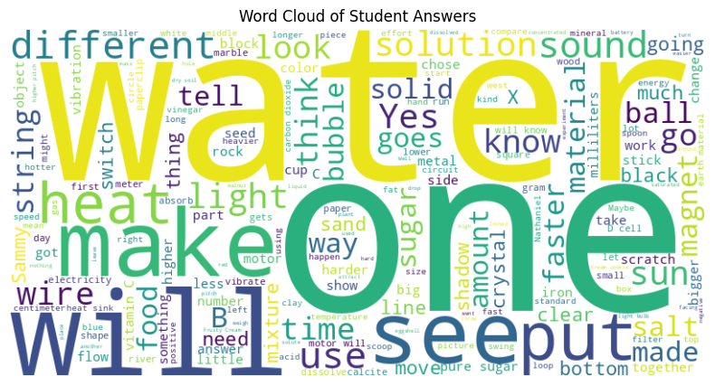
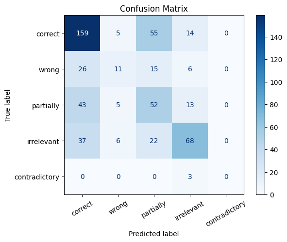
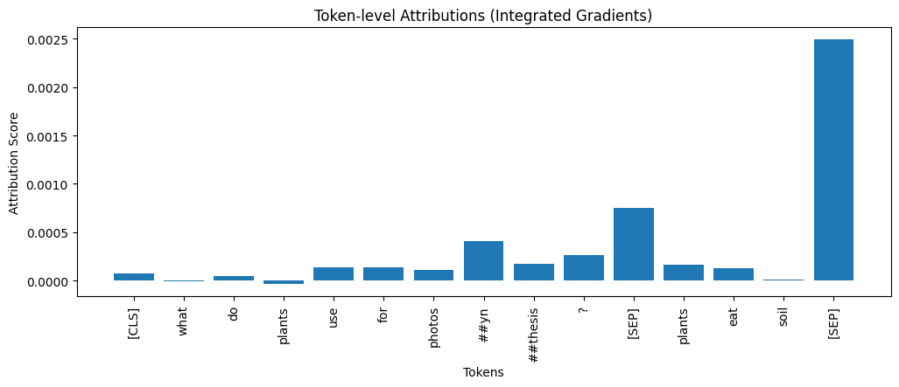

# SciEntsBank BERT: Misconception Detection in Student Short Answers  

  

## 📌 Project Overview  
This project applies **NLP and explainable AI** to the [SciEntsBank dataset](https://huggingface.co/datasets/nkazi/SciEntsBank), which contains student short answers labeled into five categories:  
Correct, Wrong, Partially correc, Irrelevant, and Contradictory.
   

This project fine-tuned **BERT-base** on this dataset and conducted analysis of the model’s performance and explainability to better understand how NLP models can assist teachers in detecting student misconceptions.  

---

## 📊 Workflow  
1. **EDA (Exploratory Data Analysis)**  
   - Checked null values and class distribution  
   - Visualized answer length, label imbalance, and common words  

2. **Model Fine-tuning**  
   - Fine-tuned `bert-base-uncased` using HuggingFace Trainer  
   - Achieved ~54% accuracy and macro-F1 of ~0.38  

3. **Evaluation & Analysis**  
   - Generated **confusion matrix** and **classification report**  
   - Model performs best on *correct* and *irrelevant* categories  
   - Low recall on *wrong* → fails to detect misconceptions consistently  

4. **Explainability**  
   - Applied **Integrated Gradients (Captum)** for token-level attributions  
   - Found model often over-relies on structural tokens like `[SEP]`  
   - Misconception tokens (e.g., *eat soil*) received weak attribution → explains poor recall on *wrong*  

---

## 📈 Results  
### Common Words

### Confusion Matrix  

### Example Attribution (Wrong Answer: *Plants eat soil*)  

- Model predicted: **Correct**  
- True label: **Wrong**  
- Attribution: High weight on `[SEP]`, low weight on *eat/soil* → model missed misconception keywords.  

---

## 🎓 Educational Insights  
- The model is reliable at recognizing correct answers and filtering irrelevant ones.  
- It struggles to distinguish nuanced misconceptions, highlighting the importance of **explainability tools** for diagnosis.  
- Attribution analysis explains *why* the model makes errors and how to improve training data.  

---

## 🔮 Future Work  
- Address class imbalance (class weights, data augmentation)  
- Experiment with stronger models (DeBERTa, RoBERTa)  
